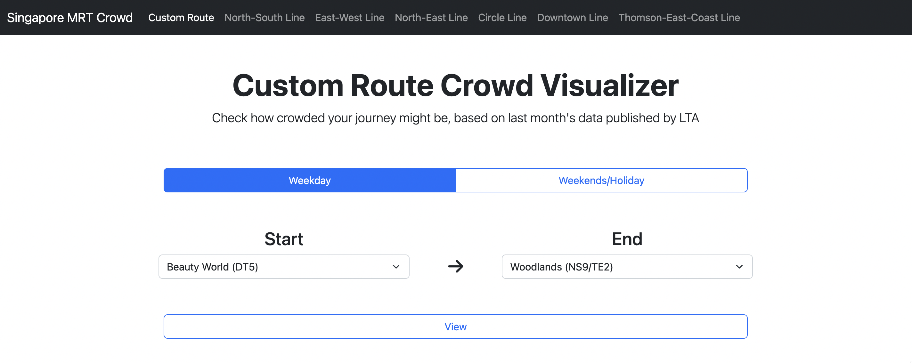
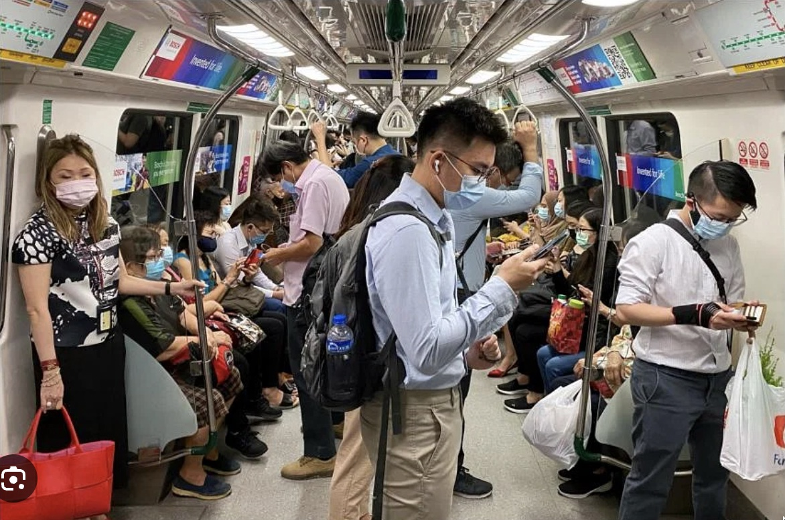
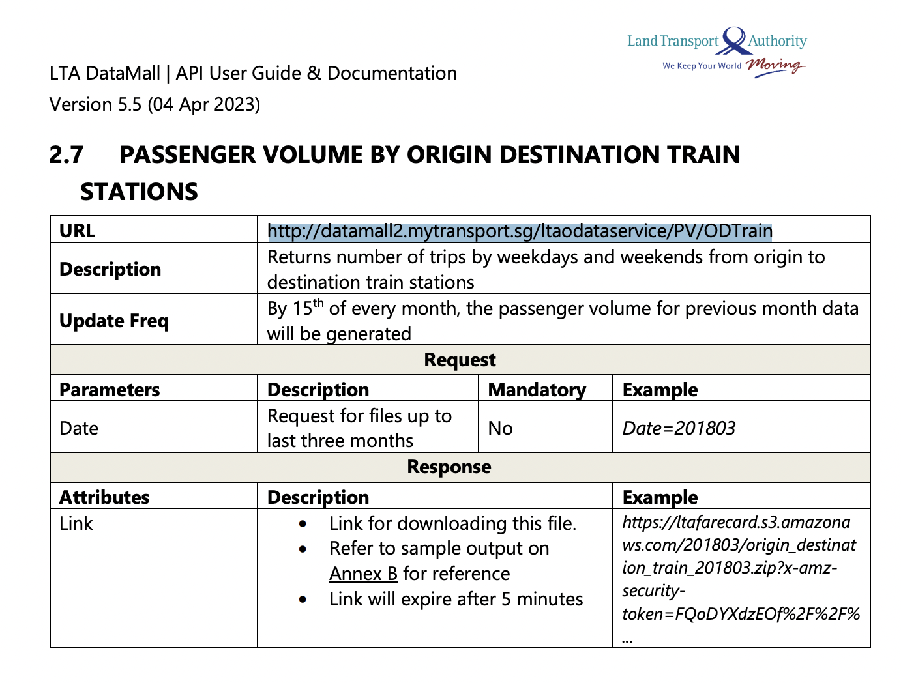
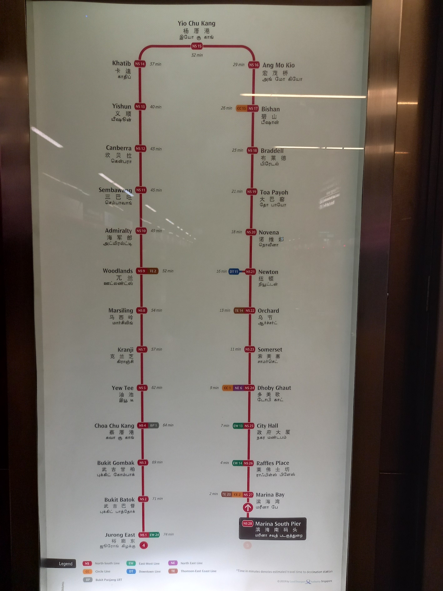
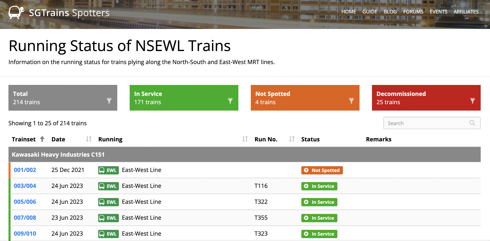

# Singapore MRT Crowd Visualization

This project aims to visualize the crowdedness of MRT trains in Singapore, based on the monthly origin-destination trip data provided by the Land Transport Authority (LTA). The visualization is a custom built heatmap that provides a visual estimate of how crowded a train will be between any two stations along the network. Here is an example of the crowdedness along the NS line on a weekday:

I have also built a simple web app that generates this visualization for custom routes between any two stations, including transfers. You can find the web app at:

https://boundtotheearth.github.io/MRT_Crowd_VIz

# Motivation

(Image from Straits Times)

## How crowded will my train ride be?

While LTA provides data on the current and forcasted crowdedness inside train stations, no such data exists for the trains themselves.

As a technical challenge for myself, I want to try building the data vizualization from scratch, without using any of the typical data viz libraries like matplotlib or seaborn. Also, it would be meaningless to just replicate the look/feel of one of those tools, so I want to create something that is impossible (or just really hard) to acheive with those tools.

# Raw Data

## 1. Passenger Volume by Origin Destination Train Stations

The raw data is obtained from [LTA Datamall] (https://datamall.lta.gov.sg/). The dataset name is: PASSENGER VOLUME BY ORIGIN DESTINATION TRAIN STATIONS.

This dataset provides the number of trips made between each pair of train stations, broken down by hour, and by weekdays/weekends, as a CSV file.

Here is an example of a row in the csv file:

2023-04,WEEKDAY,12,TRAIN,EW24/NS1,NS16,203

For all weekdays in April 2023, from 12 noon to 1 pm, the total number of passenger trips made from EW24/NS1 (Jurong East) to NS16 (Ang Mo Kio) is 203.

It is important to note that this data counts the number of passengers, but does not contain any information on the route that each passenger takes. When travelling from EW24/NS1 (Jurong East) to NS16 (Ang Mo Kio), a passenger can choose to take the EW line to CC22/EW21 (Buona Vista), transfer to the Circle line, travel to NS17/CC15 (Bishan), then transfer back to the NS line to travel to NS16 (Ang Mo Kio). However, a passenger that wants to avoid transfers may choose to take a direct route along the NS line. In my experience, the transfer route seems to be preferred (due to the NS line being commonly perceived as being a "slow" line), but a non-negligible number of passengers still choose the direct route.

The number of people travelling between Jurong East and Ang Mo Kio will contribute to the number of people on a train travelling between Buona Vista and Bishan, as well as on a train travelling along the NS line.

## 2. Estimated Travel Times

Thankfully, the estimated travel times between each station along a line is publicly available. Unfortunately, this isn't available to download, or through an API anywhere.  WHile I COULD scrape this site for the info, I think it would be much faster for me to just get it directly from the source. At each train station, there are signs that display the estimated travel times between each station along the line. So I went around the train network taking pictures of these signs, then manually entering the travel times.

## 3. Estimated Train Capacity

The crowdedness of a train dosen't just depend on the number of people on board. It also depends on how much space there is on the train. For example, the Circle line is a "medium-capacity" line, which runs trains that are smaller than the NS line. Even for the same line, there may be different train models in operation, with some being modified in various ways that change their capacity. Surprisingly, there are train enthusiasts in Singapore that keep track of the trains that are in operation, along with detail information and technical specs on each train model. This information is available over at https://spotters.sgtrains.com/ and I simply took an average of the capacities across the trains in operation, for each line.

# Data Processing
## Building the Network Graph
[Image of networkX graph]

Using the information on 

## Estimating Passenger Route Choice
I am using a basic method to estimate the number of passengers that choose to take each route:
1. Find possible routes between the origin and destination station
    1.1 Find the 3 shortest routes between the stations
    1.2 Keep only the routes that are within 15 mins travel time of the fastest route (passengers are unlikely to take a route if it takes too long, even if theres less transfers)
2. Find the relative travel time for each route
3. Distribute the total number of passenger trips along each route, according to the proportion of travel time. i.e. The route with the shortest time has the most passengers

For example, there are a total of 203 trips from Jurong East to Ang Mo Kio for weekdays 12 noon to 1pm. The estimated travel time for the direct route using the NS line is 45 minutes. The estimated travel time for the transfer route through the circle line is roughly the same, at 44 minutes due to the additional transfers needed.

Direct route = (((44+45) - 44) / (44+45)) * 203 = 100 passengers
Transfer route = (((44+45) - 44) / (44+45)) * 203 passengers = 102 passengers

There is some research that suggests better/more accurate ways of estimating the number of passengers along each route. A better method will lead to differences in the estimated number of people in a train between each station along a line, but I belive that it is unlikely to significantly affect the general trend of crowdedness. Still there is a big opportunity for improvement here.

## Building the Vizualization

## Making Sense of the Numbers

### V1: By the Numbers

### V2: A Nonlinear Measure of Crowdedness

# Final Result
Here are the generated crowd visualizations for each line, for both weekdays and weekends/holidays.

[North South Line](https://boundtotheearth.github.io/MRT_Crowd_Viz/NSL.html)

[East West Line](https://boundtotheearth.github.io/MRT_Crowd_Viz/EWL.html)

[North East Line](https://boundtotheearth.github.io/MRT_Crowd_Viz/NEL.html)

[Circle Line](https://boundtotheearth.github.io/MRT_Crowd_Viz/CCL.html)

[Downtown Line](https://boundtotheearth.github.io/MRT_Crowd_Viz/DTL.html)

[Thomson East Coast Line](https://boundtotheearth.github.io/MRT_Crowd_Viz/TEL.html)

# Observations

## Peak Hours

## Utilization of the TEL

# Known Limitations & Concerns

## Transfer Times
The estimated time spent on transferring between lines at a station is currently fixed at 8 mins. In reality, the transfer time will vary greatly based on several factors, including demand and train frequency. One factor that could be taken into account is the station size. Transferring at larger stations like Dhoby Ghaut or Outram Park will likely take 1-2 minutes longer than at a station where the lines are right next to each other, like City Hall.

## Peak/Non-Peak Hours
The LTA website states that the weekday peak hours are between 7.30am to 9.30am, and between 5.30pm to 7.30pm. However, the data on trip numbers is provided at an hourly interval (e.g. 7am to 8am). In my calculations, I set the peak periods to extend across the hour intervals (7am to 10am and 5pm to 8pm). This means that the train frequencies used for the estimation in the beginning and end of the peak periods may be higher that their actual frequencies, resulting in lower crowd estimates. I settled on this over the alternative (8am to 9am and 6pm to 7pm) as another part of the LTA website (pictured below) gives the peak hours as 7am to 9am instead (however there is no mention of the evening peak peiod). The ideal scenario would be to have more detailed data, in at least half-hour intervals.

## Split lines
Not all train lines are just lines. Notably, the EW line has an extension that goes to Changi Airport, and the Circle line has a split at Promenade station, with line travelling to Dhoby Ghaut and another to Marina Bay. The auto-generated vizualizations can't account for these split lines.

# Future Work

I am interested in replicating this for the bus network in Singapore, but this will likely be much more challenging. There are over ~1500 bus stops in Singapore, compared to the ~150 train stations in Singapore. 